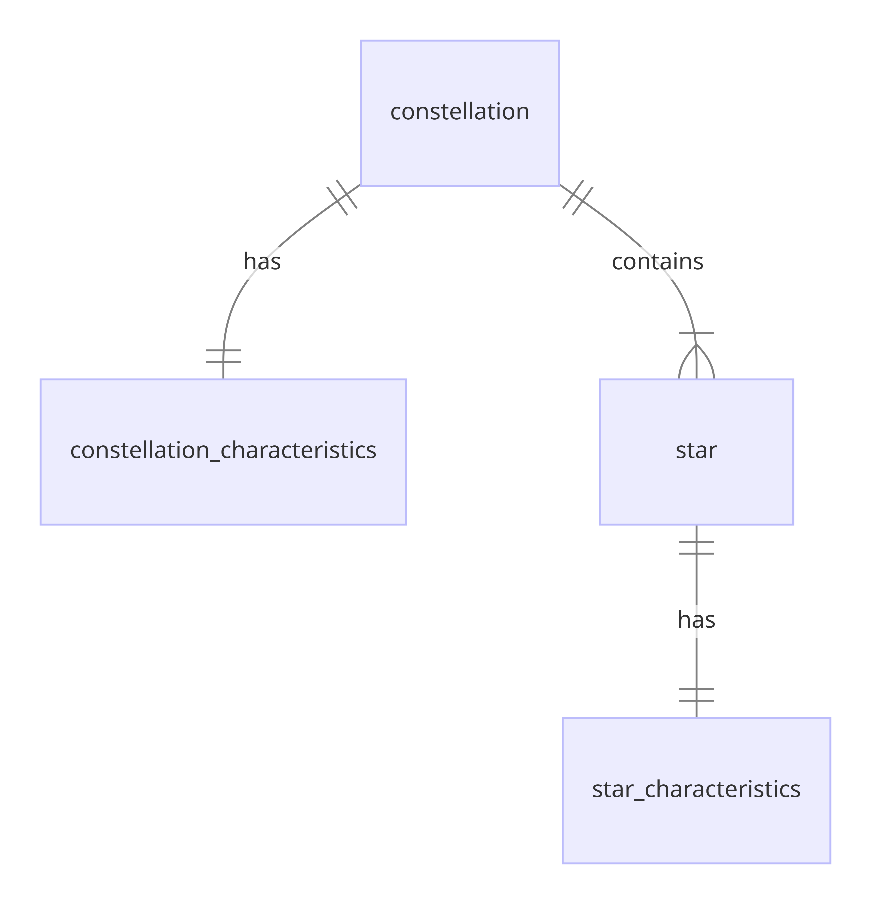

# Design Document

By Akbar Gafurov

Video overview: <https://youtu.be/kqKvpLgFF9M>

## Scope

The database for CS50 SQL final project includes all data necessary for observation of constellation and their stars as well as using scientific measurements and characteristics to make further advancements in the field of astronomy. As such, included in the database's scope is:

* Constellations, including all basic identifying information
* Constellation characteristics, including all scientific-accurate measurements such as right ascension and declination
* Stars, including all basic identifying information
* Star characteristics, including all scientifc-accurate measurements such as spectral type or luminosity class

Out of scope are elements like asteroids, planets, and galaxies.

## Functional Requirements

This database will support:

* CRUD operations for constellations and stars
* Viewing constellations and stars in these constellations to find crucial information for amateur astronomers and astrophotographers
* Adding constellation and star characteristics as well as any new stars to enlarge the database

This version of the system will support only constellations and stars

## Representation

Entities are captured in MySQL tables with the following schema.

### Entities

The database includes the following entities:

#### Constellation

The `constellation` table includes:

* `id`, which specifies unique ID for each constellation as an `INT`. This column has `PRIMARY KEY` constraint applied as well as `AUTO_INCREMENT` keyword to generate unique ID numbers.
* `constellation`, which specifies the constellation's name as `VARCHAR(30)`, given `VARCHAR` is appropriate for strings. This column has `UNIQUE` constraint to ensure all values are unique.
* `iau_abbreviation`, which specifies the IAU abbreviation of the constellation as `CHAR(3)`, given `CHAR` is appropriate for set number of characters. This column has `UNIQUE` constraint applied to ensure all values are unique.
* `nasa_abbreviation`, which specifies the NASA abbreviation of the constellation as `CHAR(4)`, given `CHAR` is appropriate for set number of characters. This column has `UNIQUE` constraint applied to ensure all values are unique.
* `discoverer`, which specifies a person who discovered the constellation as `VARCHAR(30)`, given `VARCHAR` is appropriate for strings. This column has `DEFAULT` constraint applied to ensure some of the values can be automatically defaulted to `Ptolemy`.
* `origin`, which specifies the year when the constellation was discovered as `VARCHAR(7)`. `VARCHAR(7)` was chosen because some of the values will not be numeric. This column has `DEFAULT` constraint applied to ensure some of the values can be automatically defaulted to `ancient`.
* `symbolism`, which specifies the meaning of the constellation as `VARCHAR(60)`, given `VARCHAR` is appropriate for strings.

All columns in the `constellations` table are required and hence should have the `NOT NULL` constraint applied. No other constraints are necessary.

#### Constellation Characteristics

The `constellation_characteristics` table includes:

* `id`, which specifies unique ID for each constellation characteristic as an `INT`. This column has `PRIMARY KEY` constraint applied as well as `AUTO_INCREMENT` keyword to generate unique ID numbers.
* `constellation_id`, which is the ID of the constellation on the night sky as an `INT`. This column thus has the `FOREIGN KEY` constraint applied, referencing the `id` column in the `constellation` table to ensure data integrity and relate two tables together.
* `right_ascension`, which specifies the right ascension of each constellation as `DOUBLE`, given `DOUBLE` is appropriate for floating-point numbers.
* `declination`, which specifies the declination of each constellation as `DOUBLE`, given `DOUBLE` is appropriate for floating-point numbers.
* `hemisphere`, which specifies whether the constellation is northern or southern hemisphere as `ENUM`, given `ENUM` is appropriate for storing options.
* `seasonal_visibility`, which specifies whether the constellation can be seen in one of four seasons (winter, spring, summer, autumn) as `ENUM`, given `ENUM` is appropriate for storing options.
* `zodiac`, which specifies whether the constellation is a zodiac constellation or not as `ENUM`, given `ENUM` is appropriate for storing options.

All columns are required and hence have the `NOT NULL` constraint applied where a `PRIMARY KEY` or `FOREIGN KEY` constraint is not.

#### Star

The `star` table includes:

* `id`, which specifies unique ID for each star as an `INT`. This column has `PRIMARY KEY` constraint applied as well as `AUTO_INCREMENT` keyword to generate unique ID numbers.
* `constellation_id`, which is the ID of the constellation on the night sky as an `INT`. This column thus has the `FOREIGN KEY` constraint applied, referencing the `id` column in the `constellation` table to ensure data integrity and relate two tables together.
* `star`, which specifies the star's name as `VARCHAR(60)`, given `VARCHAR` is appropriate for strings. This column has `UNIQUE` constraint to ensure all values are unique.
* `bayer_designation`, which specifies the Bayer designation of the constellation as `VARCHAR(60)`, given `VARCHAR` is appropriate for strings. This column has `UNIQUE` constraint to ensure all values are unique.

All columns are required and hence have the `NOT NULL` constraint applied where a `PRIMARY KEY` or `FOREIGN KEY` constraint is not.

#### Stars Characteristics

The `star_characteristics` table includes:

* `id`, which specifies unique ID for each star characteristic as an `INT`. This column has `PRIMARY KEY` constraint applied as well as `AUTO_INCREMENT` keyword to generate unique ID numbers.
* `star_id`, which is the ID of the star in the constellation as an `INT`. This column thus has the `FOREIGN KEY` constraint applied, referencing the `id` column in the `star` table to ensure data integrity and relate two tables together.
* `right_ascension`, which specifies the right ascension of each star as `DOUBLE`, given `DOUBLE` is appropriate for floating-point numbers.
* `declination`, which specifies the declination of each star as `DOUBLE`, given `DOUBLE` is appropriate for floating-point numbers.
* `distance`, which specifies the distance (in light years) to the star from Earth as `DOUBLE`, given `DOUBLE` is appropriate for floating-point numbers.
* `spectral_type`, which specifies the spectral type (O, B, A, F, G, K, M) of each star as `ENUM`, given `ENUM` is appropriate for storing options.
* `mass`, which specifies the mass (in solar masses) of each star as `DOUBLE`, given `DOUBLE` is appropriate for floating-point numbers.
* `radius`, which specifies the radius (in solar radius) of each star as `DOUBLE`, given `DOUBLE` is appropriate for floating-point numbers.
* `luminosity`, which specifies the luminosity (in solar luminosity) of each star as `DOUBLE`, given `DOUBLE` is appropriate for floating-point numbers.
* `luminosity_class`, which specifies the luminosity class (from supergiant to white dwarf) of each star as `ENUM`, given `ENUM` is appropriate for storing options.
* `luminosity`, which specifies the brightness (in solar brightness) of each star as `DOUBLE`, given `DOUBLE` is appropriate for floating-point numbers.
* `temperature`, which specifies the temperature (in Kelvin) of each star as `INT`, given `INT` is appropriate for storing values from thousands to hundred thousands.
* `color`, which specifies the color (from white to red) of each star as `SET`, given `SET` is appropriate for storing multiple options.

All columns are required and hence have the `NOT NULL` constraint applied where a `PRIMARY KEY` or `FOREIGN KEY` constraint is not.

### Relationships

The below entity relationship diagram describes the relationships among the entities in the database.

As detailed by the diagram above,

* A constellation can have 1 to many stars associated with it, whereas a star can be associated only with one constellation.
* A constellation can have only one constellation characteristic, and only one constellation characteristic can be associated with a constellation.
* A star can have only one star characteristic associated with it. At the same time, star characteristic can also be assigned only to one star.

## Optimizations

Per the typical queries in `queries.sql`, it is common for users of the database to look up data about constellation and star names. For that reason, indexes are created on the `constellation` and `star` columns to speed the identification of constellations and stars by those columns.

Likewise, users commonly search up data on where you can find the constellation on the night sky, so an index is created on `hemisphere` column in `constellation_characteristics` table to increase the speed of these searches. To find out more about the stars' distances, users can utilize an index created on `distance` column in `star_characteristics` table to be more efficient and quick.

Three separate views, including northern hemisphere constellations, southern hemisphere constellations, and zodiac constellations, were also designed to optimize the search.

## Limitations

The current schema can't support more scientific and technical data. It also doesn't accommodate other important cosmic objects, including asteroids, planets, and even galaxies! To include all of this, new tables and columns should be created to enlarge exisiting system.
